# Synthra - Documentation

## General

Synthra is a file hosting application, which was developed for purposes of the courses `Implementation of free and open source systems` and `Team project` at FCSE. Several key features include uploading and downloading files, user registration and login, file sharing with specific users and encryption.

This project was developed by:

- Stefan Milev - 206055
- Alek Jarmov - 206012
- Ana Marija Atanasovska - 206004
- Danilo Najkov - 206033

under the mentorship of prof. d-r Boban Joksimoski.

This documentation is very detailed, and if you do not want to read it, it is summarized in the project's `README.md` in the repository root.

## Live Version

The live version of the project is available here: <https://synthra.delemangi.com>. This is the version of the application on the `main` branch of the repository.

## Code

The code of this project is available at <https://github.com/Delemangi/synthra>. An alternative mirror for the source code is available at <https://gitlab.finki.ukim.mk/ioss/synthra/> (which also requires FCSE CAS login).

## Features

Synthra includes the following features, and probably some more:

### Registration & Login

Users can easily register for an account and log in to access Synthra. During registration, users provide necessary information to create their account. Ar least 6 character usernames and passwords are enforced for security. Once registered, they can log in using their credentials to access their files, upload new content, and manage their account settings.

### File Uploads & Downloads

Users are able to upload all types of files to Synthra and are then able to share links to the uploaded files with other users for downloading. When uploading a file, users have the option to set the file's visibility as either public or private.

### File Whitelist

Files have the option to be set to private or public. If the file is set to public, it becomes accessible to everyone; anyone with the link can view and download the file without any restrictions.

If the file is set to private, only the user who uploaded the file can see it initially. The user can then create a list of specific people who are allowed to view the file. The user cannot share private files to users which do not exist. These selected individuals can access the file through the link. Anyone not on this list will be unable to see or download or preview the file.

### Quotas

To ensure fair usage and maintain system performance, Synthra imposes a quota on file uploads. Each user has a limit on the total amount of files they can upload. This quota helps prevent any single user from consuming excessive storage resources.

### File Expiration

Uploaded files are not stored indefinitely. To manage storage space efficiently and maintain optimal system performance, files are automatically deleted 14 days after the upload date.

### Two factor authentication (2FA)

Users can enhance the security of their Synthra accounts by setting up an authenticator app to generate 2FA codes for their application. To do this, users should first choose a compatible authenticator app, such as Google Authenticator, Authy, or Microsoft Authenticator. After selecting an app, they need to navigate to the account settings in Synthra and enable the 2FA option. This will display a QR code on the screen. The user should then open the authenticator app and scan the QR code to link the app to their Synthra account. Once the QR code is scanned, the app will generate a 6-digit verification code. Entering this code in Synthra completes the setup process. From this point onward, users will be required to enter a new verification code generated by the authenticator app each time they log in to Synthra, ensuring an additional layer of security by confirming that only the user with access to the linked authenticator app can access the account, even if the password is compromised.

### Intuitive UI

The user can see his files, webhooks and account details on the user interface of the application. The UI includes intuitive buttons and tooltips to explain to beginners what each option and button does.

### Encryption

Users have the option to encrypt their files using a password before uploading them to Synthra. This encryption process ensures that the files are secure and protected from unauthorized access. When a file is encrypted, a password chosen by the user is used to perform the encryption. This password is not stored on the server, adding an extra layer of security.

Because the password is never kept on the server, even if an attacker were to gain access to the server, they would not be able to decrypt and access the encrypted files without the password. The encryption process transforms the file's contents into a format that is unreadable without the correct decryption key, which in this case, is the password known only to the user.

To decrypt and access the file, the user or any authorized recipient must provide the correct password. This ensures that only those who have been given the password by the user can view the file's contents. This method of encryption provides robust protection for sensitive files, maintaining their confidentiality and integrity even in the event of a security breach.

### Webhooks

Users can define their own webhooks to send files to them. This system allows users to add and delete webhooks according to their needs. Once webhooks are set up, users can easily select a file and dispatch it to all the configured webhooks. This functionality is particularly useful for integrating with various external services and automating workflows.

For instance, after defining webhooks, a user might choose a file and send it to a webhook URL, which could trigger an event in another application or service, such as uploading the file to a cloud storage service, processing it through an API, or notifying a team via a messaging app.

### File Preview

Users can preview a variety of uploaded files, including images, text, audio, and video. This feature supports multiple file extensions, making it convenient to view different types of content directly within the application. The supported file types include:

- .pdf: application/pdf
- .jpg: image/jpeg
- .jpeg: image/jpeg
- .png: image/png
- .gif: image/gif
- .mp3: audio/mpeg
- .wav: audio/wav
- .ogg: audio/ogg
- .mp4: video/mp4
- .avi: video/x-msvideo
- .mov: video/quicktime
- .wmv: video/x-ms-wmv
- .txt: text/plain
- .html: text/html
- .csv: text/csv
- .json: application/json
- .xml: application/xml
- .svg: image/svg+xml

The feature works by downloading the files to the frontend and embedding them in an iframe on the website.

### Responsive

The user interface of the application is mobile friendly.

### Dark Mode Toggle

Please always use dark mode. Light mode is stupid.

## Technologies

Synthra contains a frontend and a backend application in a monorepo pattern.

The backend application is built using [FastAPI](https://github.com/tiangolo/fastapi), which is a pretty fast and lightweight Python web server, with supported Python versions including 3.11 and 3.12, [SQLAlchemy](https://github.com/sqlalchemy/sqlalchemy) as an object relational mapper (ORM), and [Alembic](https://github.com/sqlalchemy/alembic) for tracking the history of database migrations and automatically applying them.

FastAPI implements the ASGI specification for Python web servers, and so it needs an ASGI server to run the application. We are using [Uvicorn](https://github.com/encode/uvicorn).

The frontend application it built using [SvelteKit](https://github.com/sveltejs/kit), which is a web framework for building single page apps or server side rendering. It also includes a built in folder based router.

The data is persisted into the [PostgreSQL](https://github.com/postgres/postgres) relational database, using the ORM and migration technologies from above.

For dependency management, the backend application uses [Poetry](https://github.com/python-poetry/poetry), which defines its details in the `pyproject.toml` and `poetry.lock` files. The frontend application's counterparts are NPM, with the files `package.json` and `package-lock.json`. The files with `lock` in their names define the entire dependency structure frozen, so that anyone else installing the dependencies will end up with the exact same structure as the developer.

## Linters & Formatters

The backend application contains the following linters and formatters:

- Backend
  - [Ruff](https://github.com/astral-sh/ruff) (linter & formatter)
  - [MyPy](https://github.com/python/mypy) (linter)
  - Or alternatively, if you wish to use the other supported stack of linters:
    - [Black](https://github.com/psf/black) (linter & code formatter)
    - [Flake8](https://github.com/PyCQA/flake8) (linter)
    - [isort](https://github.com/PyCQA/isort) (linter)
- Frontend
  - [Svelte Language Tools](https://github.com/sveltejs/language-tools) (linter & code formatter)
  - [ESLint](https://github.com/eslint/eslint) (linter)
  - [Prettier](https://github.com/prettier/prettier) (code formatter)
- General
  - [SonarLint](https://www.sonarsource.com) (linter) - available as a CI, and as an extension (plugin) for common IDEs

The project also contains an `.editorconfig`, the universal configuration for code and text formatting.

For pre-commit hooks, the `pre-commit` PyPI package is being used. The linters have to pass before being able to create a commit. If you wish to install the pre-commit hooks, run `poetry run pre-commit install` (after you've installed the backend's dependencies with Poetry).

These linters are being ran in a CI. More details below.

## Tests

Both the frontend and backend contains unit tests, using [pytest](https://github.com/pytest-dev/pytest) on the backend, and [Vitest](https://github.com/vitest-dev/vitest) on the frontend. The tests are written for verifying the correct functionality and behaviour of different functions with important logic for functioning of the application. They are being ran in a CI. More details below.

To run the tests on the backend, run `poetry run pytest`. To run the tests on the frontend, run `npm run test`. You have to be in the respective directories (either `backend` or `frontend`) to be able to run these commands.

## Docker

Synthra is designed to run inside a Docker environment, although it is not required. Docker automates orchestrating all the services of the project, so that the user does not have to setup several services manually.

The frontend and backend both contain their own Docker image defined by their respective `Dockerfile`, which is optimized as much as possible and designed to be possible to be built for varying platforms (`linux/amd64` and `linux/arm64` were tested, but it's likely that other newer Linux based platforms and architectures are supported as well).

The repository contains several Docker Compose configurations:

1. `docker-compose.yaml` is for testing and development purposes. It runs the database, frontend, backend and an instance of pgAdmin for testing purposes (to be able to peek into the database). It features multiple open ports for testing.
2. `docker-compose.prod.yaml` is for production purposes. It runs the required services just for running the application: frontend, backend and database. It features less open ports and no pgAdmin instance because of security concerns (no one should be able to access the database in production, except for the backend application).
3. `.devcontainer/docker-compose.yaml` is for the Dev Container configuration. More details below.

It is possible to run this outside a Docker environment, but it's not recommended. Use a Dev Container if you need to test features on the backend or frontend (using hot reloading).

The Docker Compose configurations also expose some volumes: the backend application exposes a volume for the uploaded files and the database exposes a volume for its files. This is to ensure that, even if the containers are removed or turned off, the data will be persisted and no state will be lost.

You may spin up any of these Docker Compose configurations using `docker compose up -d`, provided that you have Docker (Desktop) up and running. By default, it takes `docker-compose.yaml` from the current working directory, but you can override the Docker Compose configuration file using the `-f` flag, as such: `docker compose up -f docker-compose.prod.yaml -d`. You may also take a look at the logs of the spun up containers using `docker compose logs -f`.

## Environment Variables

Here are the environment variables used by the project, as well as the default assigned values to them (as per the `.env.schema` file, which contains these default values):

```env
POSTGRES_DB=synthra
POSTGRES_HOST=database
POSTGRES_PORT=5432
POSTGRES_USER=synthra
POSTGRES_PASSWORD=synthra

DATABASE_URL=postgresql+asyncpg://$POSTGRES_USER:$POSTGRES_PASSWORD@$POSTGRES_HOST:$POSTGRES_PORT/$POSTGRES_DB
VITE_BASE_URL=http://localhost:8002
```

The first part of the environment variables with the `POSTGRES_` prefix as well as the `DATABASE_URL`, are for the database connection. These are being pulled by the backend during runtime.

However, the `VITE_BASE_URL` environment variable (which represents the URL to the backend) is being pulled during build time of the frontend (by `Dockerfile` `ARG` and `ENV` instructions). There is a default value of `http://localhost:8002` (which is where the backend would be accessible during a Docker Compose orchestration). This environment variable is not utilized during runtime. In the repository, this is set in the repository settings as a globally available environment variable. More details below.

## Development Workflow

The project utilizes the following development workflow:

- The `main` branch contains the latest version of the application
- For any commits, branch off the `main` branch, and create a pull request to merge back in once the feature or bugfix is done

For all pull requests, there is a GitHub Actions workflow defined that includes several checks. More details below.

## Migrations

When making a change to the database schema, a migration has to be created. It contains the changes to the database schema, so they can be applied in order.

To create a migration, make sure that you have installed all of the dependencies on the backend, and:

1. Sync your database with the latest migrations if it isn't already: `poetry run alembic upgrade head`
2. Make a change in the models
3. Create a new migration: `poetry run alembic revision --autogenerate -m "Migration name"`
4. Run your new migration: `poetry run alembic upgrade head`

The settings for the migrations are specified in `alemic.ini` and `env.py` in the `alembic` folder. They are set to pull the database connection string from the environment variables. Alembic requires no building, and instead just has to be ran to apply all migrations to the database before starting the FastAPI server. However, FastAPI will run all migrations before startup so you don't have to.

It is also possible to reverse migrations by running `poetry run alembic downgrade -1`.

## CI/CD

Synthra is making heavy use of continuous integrations (CIs) to verify the quality of the code being merged into the `main` branch.

The CIs are GitHub Action workflows which are triggered on the branch `main` and all pull requests with their target branch set to `main`.

The following CIs are created:

- TypeScript & Svelte (code build, linter)
- ESLint & Prettier (linter)
- Vitest (tests)
- Ruff (linter)
- MyPy (linter)
- pytest (tests)
- SonarCloud (linter)
- Backend Docker Image (Docker image build & push to DockerHub)
- Frontend Docker Image (Docker image build & push to DockerHub)
- GitLab mirror (code mirroring to another remote)
- Dependabot (create pull requests to bump outdated dependencies)
- CodeQL (security vulnerabilities)

The automated project continuous deployment (CD) works such that, whenever there is a push to the `main` branch, the CIs for Docker image building will be run, and they will upload two new images to DockerHub (one for the frontend, and one for the backend). Once complete, on the host machine, an instance of [Watchtower](https://github.com/containrrr/watchtower) is running. It works such that on an interval, it checks whether any running Docker container on the machine has a newer version on the registry it was pulled from. If there is a new version, it will be pulled and the container will be restarted. To ensure flawless deployments, pull requests cannot be merged while there are issues reported by the CIs from above, and all database schema changes have to go through migrations, so that the database does not have to be wiped on each restart, and to maintain data persistency.

The `VITE_BASE_URL` environment variable is overwritten in the repository, so that the backend URL can point to the correct location in the automated deployment.

## Dev Container

This project includes a Dev Container. The Dev Container is a way of developing with VS Code inside of a Docker environment. The upsides of this are that you can achieve with just a few clicks hot reloading inside of a Docker container, while the database is always running. The downsides are that this generally requires much more computer resources (CPU and RAM) to run, as it spins up a heavy Docker container.

The Dev Container is just a Docker image (which also has its own `Dockerfile`, located in the `.devcontainer` directory, just like all the other configuration for the Dev Container). However, for running the database as well, there is a Docker Compose configuration as well in the same directory. It includes the Dev Container image, the database, and a pgAdmin instance for testing.

For automating all of the tedious and common tasks when setting up this project, the Dev Container runs a shell script on creation to install all dependencies, create all required directories, setup permissions and such, so that the developer can start working on the project right away, without having to read much documentation on how to set it up.

The Dev Container also contains a recommended set of VS Code extensions and settings which can be used when developing this project. They are also recommended to the developer if running the project outside a Dev Container as well.

## Debuggers

Debugging configurations are available for both the frontend and backend applications in VS Code. However, because of the complexity of spinning up all required services to run the application (mostly the database), it is recommended to run the debuggers inside a Dev Container if you happen to need them. If you have a PostgreSQL database ready on your system (whether it is locally or in a Docker container), you can skip this step and directly start a debugger locally.

## Endpoints

You can view all of the endpoints on the `/docs` endpoint of the backend. If you are running the development `docker-compose.yaml`, you can view them on <http://localhost:8002/docs>, which is a Swagger OpenAPI instance. It includes a view like this:

## Quick Setup

Check this section out if you wish to deploy the project locally to test it out. Otherwise, if you wish to test it out without deploying it locally, check out the next section.

The quickest setup is the one using Docker. You will lose your sanity if you begin building and running this project manually. So:

1. Install Docker (on Linux), or Docker Desktop (on Windows or MacOS), and run it
2. Get the `docker-compose.prod.yaml` file (or `docker-compose.yaml`) from the repository
3. If you chose the first option, rename it to `docker-compose.yaml`
4. Get the `env.schema` file from the repository
5. Open it, edit the environment variables to your liking, and rename it to `.env`
6. Run `docker compose up -d`

You should now have Synthra up and running. It should be running on <http://localhost:3000>, assuming that you followed the instructions above and made no error. If you chose the development Docker Compose configuration (the `docker-compose.yaml` file from the repository), then you can also access pgAdmin on <http://localhost:5050>.

## Automated Deployment

Using the Docker images uploaded to DockerHub from the CIs, Watchtower redeploys them. Using an nginx reverse proxy, the backend and frontend are proxied independently on different subdomains (<https://synthra.delemangi.com> for the frontend, and <https://synthra-backend.delemangi.com> for the backend). CORS is configured appropriately to let all valid requests in (those originating from the frontend). Both of these subdomains are protected by SSL certificates issued by CloudFlare.

You can check out the automated deployment at <https://synthra.delemangi.com>. This contains the version of the code as it is on the `main` branch.

## Installation

You should probably use Docker for this. However, a non-Docker guide is available below.

### Docker (Installation)

Ensure that you have Docker (on Linux), or Docker Desktop (on Windows or MacOS) installed and running.

While building the frontend, the environment variable `VITE_BASE_URL` should be present, which is the URL to the API. Refer to the section `Environment Variables` for more information. Afterwards:

1. Run `git clone git@github.com:Delemangi/synthra.git` (or `git clone https://github.com/Delemangi/synthra.git`)
2. Run `docker compose build`

The Docker images which will be built should correspond to your current platform on which you are building the image. Otherwise, you can specify a `--platform` flag on the build commands to choose a platform and architecture. Docker Compose configurations also support specifying the platform in each image set to be built from source locally.

### Manual (Installation)

The manual setup requires that you have the following tools installed:

- [Python](https://www.python.org/) >= v3.11
- [Poetry](https://python-poetry.org/) (feel free to use whichever version `pip` installs for you)
- [Node.js](https://nodejs.org/en) >= v20
- [PostgreSQL](https://www.postgresql.org/) >= v16

Although older versions of these tools may work with Synthra, they are untested and it's recommended to stick to these versions, at least for Node.js and Python. The others are more flexible.

Once you have all these dependencies installed, then:

1. Run `git clone git@github.com:Delemangi/synthra.git` (or `git clone https://github.com/Delemangi/synthra.git`)
2. Next, you have to install each module separately.

For the backend:

1. Navigate to the `backend` folder: `cd backend`
2. Run `poetry install --no-root`

For the frontend:

1. Navigate to the `frontend` folder: `cd frontend`
2. Run `npm i`
3. Run `npm run build`

## Running

You should probably use Docker for this. However, a non-Docker guide is available below.

### Running (Docker)

1. Copy or rename the `.env.sample` file to `.env`, and edit it to your liking, or leave it as is
2. Run `docker compose up -d`

### Running (Manual Setup)

1. Start the PostgreSQL service
2. Apply all migrations: `alembic upgrade head`
3. Start the backend service
   1. Open the project in your terminal
   2. Run `cd backend`
   3. Run `python -m app.main` (you can also run this with hot reloading with the `--reload` argument)
4. Start the frontend service
   1. Open the project in your terminal
   2. Run `cd frontend`
   3. If you would like to start the application in a development environment with hot reloading, then run `npm run dev`, otherwise `npm run preview`, provided that you have run `npm run build` previously

## Architecture

The project is structured as follows:

- `.devcontainer` - Dev Container configuration
- `.github` - GitHub repository configuration, as well as GitHub Actions workflows and CIs
- `.vscode` - VS Code configuration, including extensions, settings and launch configurations (debuggers)
- `assets` - non version controlled folder for keeping all uploaded files
- `backend` - backend (FastAPI) code
- `docs` - this documentation
- `frontend` - frontend (SvelteKit) code
- `pg_data` - non version controlled folder for the database
- `scripts` - scripts for testing

All files not contained within these folders (in the project root) specify metadata for the application or repository. There are also convenient application restarting scripts for development purposes.

### Backend (Architecture)

The backend code is separated into the `app` folder, while the tests are in the `test` folder, and migrations in the `alembic` folder.
All other files specify project metadata, dependencies or Docker configuration.

The backend code (`app` folder) is divided up into Python modules (with folders and `__init__.py` files) by their respective concern, e.g. all services and endpoints regarding file uploads and downloads are located within the `files` module. This is to follow the separation of concerns philosophy.

The backend's modules are `files` (for handling file related tasks, such as downloading, uploading, encrypting), `auth` (for authentication, logging in and registering), `shares` (for handling file sharing and whitelists) and `webhooks` (for webhooks). Each module contains its own endpoints (in `router.py`), services (in `service.py`), contants (in `contants.py`), PyDantic schemas (in `schemas.py`), HTTP exceptions (in `exceptions.py`), and several others unique to only one or some modules, but not all.

FastAPI uses routers to improve how routes are specified. Routers can have a base path, on which all routes which are a part of that router, get their paths joined to the router's base path. Routes can also be specified outside of routers, but in this project, because of the clear separation of concerns, and also for code cleanliness, everything (except the root/base endpoint, which is made available for testing and health checks: `/`) resides within a router. In reality, each router actually represents one of the said modules from above (files, auth, shares and webhooks). All service logic resides within one of these, respectively.

FastAPI also makes extensive use of dependency injection in routes. Using dependency injection, the database session object (with which queries are run), as well as the session token of the currently logged in user, are made available to all endpoints which need them. This provides an intuitive way of protecting endpoints which should only be available to logged in users.

For specifying the request and response schemas of requests, we can use `PyDantic` schemas. These schemas are just classes which inherit from the library's base class, and represent a format of data. For each endpoint which adheres to the REST principles (i.e. returns JSON), a PyDantic schema can be used to represent what the request takes in, and what it responds with. On the frontend, TypeScript can be used to type these schemas as well, so that we have a type safe way of transmitting data between the frontend and the backend.

Because FastAPI implements the ASGI (**Asynchronous** Server Gateway Interface), we can utilize the asynchronous nature to practically make everything non blocking and enable the application to have better performance than blocking (synchronous) frameworks out of the box.

### Frontend (Architecture)

The frontend code is separated into the `src` folder, while the tests are in the `test` folder. There is also some static content available in the `static` folder (content which gets included by the bundler always, such as a favicon or `robots.txt`). All other files specify project metadata, dependencies or Docker configuration.

Inside the `src` folder, much like the backend's code, the frontend's code is split also by separation of concerns. The `auth` folder contains authentication related logic, the `lib` folder contains reusable components, as well as types, the `routes` folder is the actual application structure (explained in more detail below), the `server` folder is for data fetching and mutating (through requests to the backend), and the `utils` folder contains various logic reused in many parts of the SvelteKit application.

SvelteKit uses what's known as directory routing. This means that instead of defining the routing inside the code, it is defined by the folder structure inside the `routes` folder. For example, the path `routes/auth/login` corresponds to that exact URL. All routes are structured by page and layout routes. Page views are defined by `+page.svelte`, and that corresponds to the actual page located at that URL.

Layout routes are a little different. They are for including some piece of code (such as styles, or a theme provider, or a fetching client provider) to the entire application. The layout route is always available to the client when he is within a route that includes one in one of its parent routes.

The available routes of the application are:

- `/auth/login` - login route
- `/auth/register` - register route
- `/download` - download file route
- `/user/2fa` - configure 2FA route
- `/user/account` - account route
- `/user/home` - files view route
- `/user/webhooks` - webhooks view route

While Svelte is for single page applications (SPA), SvelteKit is based on Svelte, but offers several more features out of the box, such as server side rendering (SSR), folder (or file) based routing, directly defining API routes, code splitting. SvelteKit comes with different adapters for ease of building and deploying it on any platform (such as locally with Node, Vercel, Netlify, CloudFlare Workers and some more options). It is comparable to what `Next.js` is for `React`.

## Communication

The communication between the frontend and the backend is done by sending HTTP requests from the frontend to the backend, and parsing the responses. The backend's URL is specified in the frontend during the build process, in which Vite takes in all environment variables prefixed with `VITE_`, and injects them into the frontend code. Since there are no environment variables in the browser, they have to be injected during the build time.

## Route Protection

Most of the routes, both on the frontend, and the backend, are protected.

The backend contains several testing endpoints for health checks if it's functioning correctly, but most of the other routes are protected.

Route protection on the backend is by session token, which means that non logged in users (guests) cannot access most of the endpoints there. That makes sense, because non logged in users should not be able to upload or download files, or do other actions, other than being able to register and login. Once a user is logged in, he is allowed access to most routes, but he is not allowed to do actions on other people's content (such as deleting someone else's file).

Route protection on the frontend functions in a similar way. The logged in user's information (session and username) is kept in the browser's local storage, and some routes are disallowed by checking whether the local storage has a valid session. If the backend rejects as token (such as when it expires after some time of user inactivity), the frontend will automatically clean up its local storage and ask the user to login again. If a guest tries accessing an endpoint which depends on a logged in user, such as their uploaded files, they will be redirected to the login screen.

## Middleware

The backend contains CORS middleware, as well as a URL normalizer middleware.

The CORS middleware is so that requests coming in to the backend can only be allowed from certain origins, such as the frontend. Requests originating from other places are disallowed.

The URL normalizer middleware is to help with the routing for when the application is behind a reverse proxy, such as `nginx`.

## Dependencies

Here is an exhaustive list of dependencies utilized by the frontend and backend:

Frontend:

- `@sveltejs/adapter-node` - For building the frontend application into a standalone runnable Node module
- `@sveltejs/kit` - UI framework
- `@sveltejs/vite-plugin-svelte` - Vite plugin for building the SvelteKit application
- `@typescript-eslint/eslint-plugin` - ESLint plugin for supporting TypeScript rules
- `@typescript-eslint/parser` - For allowing ESLint to parse and lint TypeScript projects
- `eslint` - For linting the frontend application
- `eslint-config-prettier` - Configuration for ESLint rules
- `eslint-plugin-svelte` - ESLint plugin for Svelte projects
- `prettier` - For code formatting
- `prettier-plugin-svelte` - Prettier plugin for formatting Svelte projects
- `rimraf` - For deleting previously built bundles (platform and OS agnostic rm -rf wrapper)
- `svelte` - UI framework
- `svelte-check` - Linter for Svelte related problems and syntax checking
- `tslib` - TypeScript runtime utility library
- `typescript` - JavaScript, but with types
- `vite` - For building, bundling and minifying the application into a single executable module
- `vitest` - For running unit and integration tests
- `@svelte-put/qr` - For generating QR codes (2FA)
- `@svelteuidev/composables` - For Svelte UI components
- `@svelteuidev/core` - For Svelte UI components
- `axios` - HTTP client, for sending requests
- `radix-icons-svelte` - For Svelte UI icons

Backend:

- `fastapi` - Web server
- `sqlalchemy` - Object relational mapper (ORM)
- `asyncpg` - Asynchronous driver for PostgreSQL
- `uvicorn` - ASGI compatible Python web server for FastAPI
- `python-jose` - For signing and encryption of content
- `passlib` - For password hashing
- `python-multipart` - For streaming large files
- `pydantic-settings` - For configuring PyDantic
- `APScheduler` - For scheduling cronjobs
- `discord-webhook` - For sending content to Discord webhooks
- `alembic` - For creating and managing database schema migrations
- `psycopg2-binary` - Synchronous driver for PostgreSQL (used by Alembic for creating migrations)
- `pytest` - For unit and integration tests
- `pytest-asyncio` - PyTest plugin for asynchronous tests
- `httpx` - HTTP client, for sending requests
- `trio` - For asynchronous work
- `bcrypt` - For hashing passwords and verifying hashes
- `aiosqlite` - Asynchronous driver for SQLite
- `pytest-mock` - PyTest plugin for mocking services
- `cryptography` - For cryptographic algorithms
- `pyotp` - For creating OTP tokens from seeds
- `mypy` - For code linting
- `ruff` - For code linting and formatting
- `pre-commit` - For pre-commit hooks
- `types-python-jose` - Type stubs for the `python-jose` library
- `types-passlib` - Type stubs for the `passlib` library
- `black` - For code formatting
- `flake8`- For code linting
- `isort` - For code linting and formatting

## Screenshots

### Main Screen

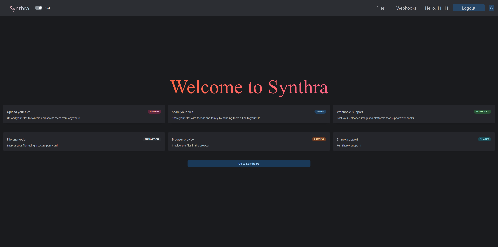

### Files List

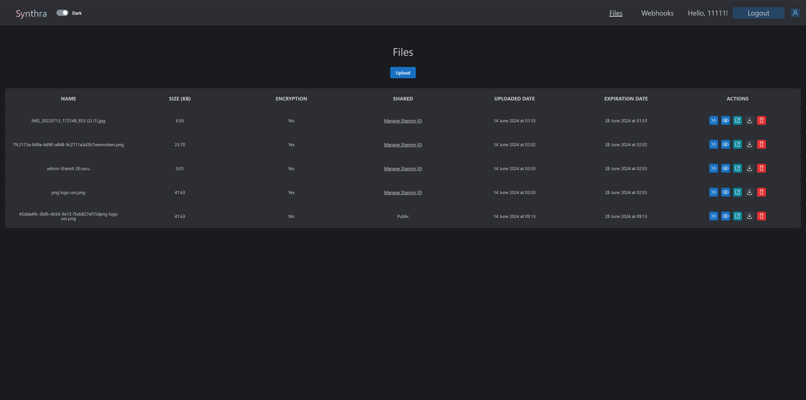

### 2FA

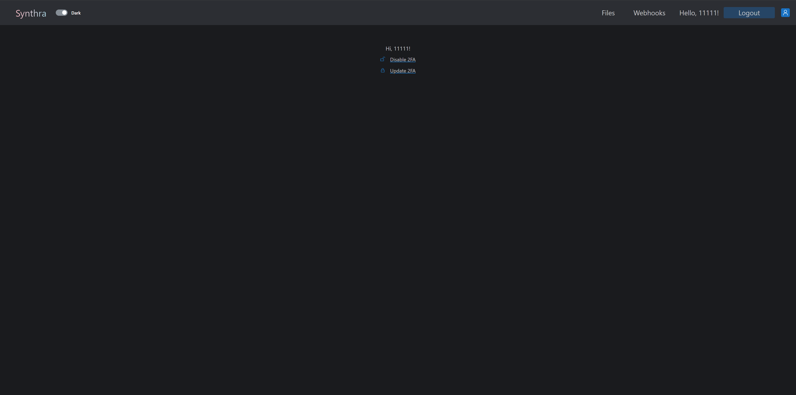

### Preview

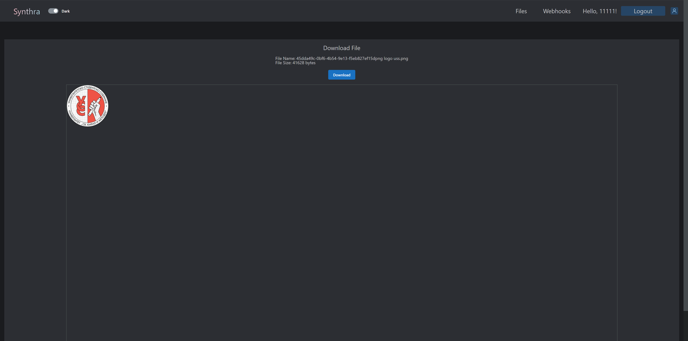

### Login

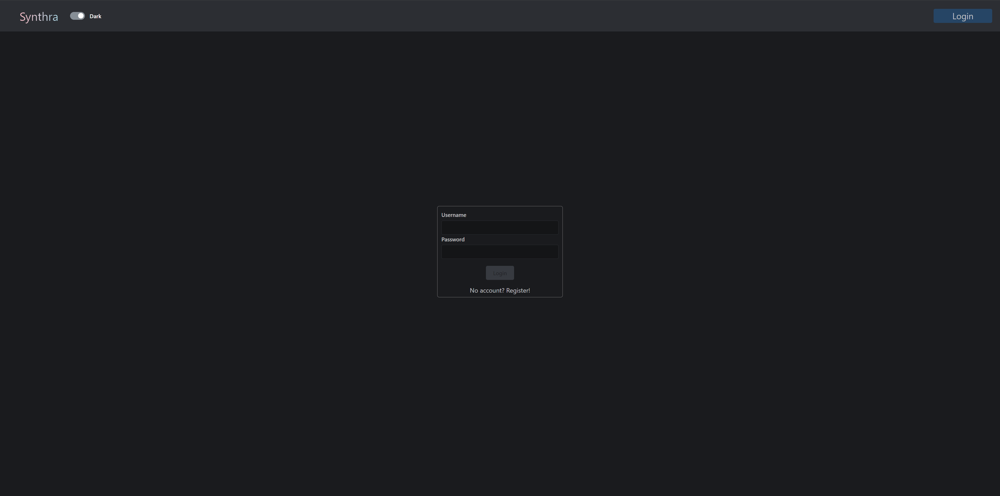

### Register

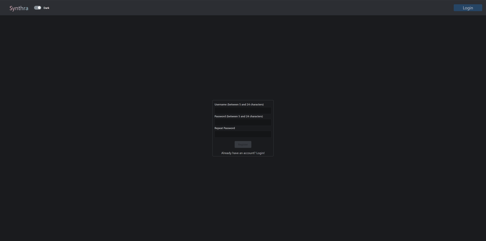

### Webhooks List

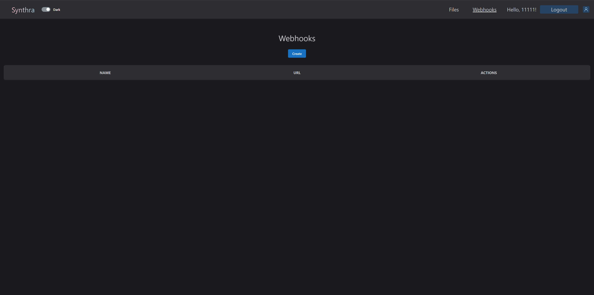

### 2FA (Update)

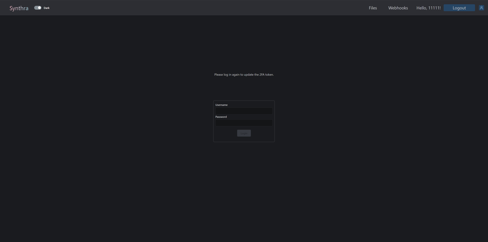

### Entire Architecture

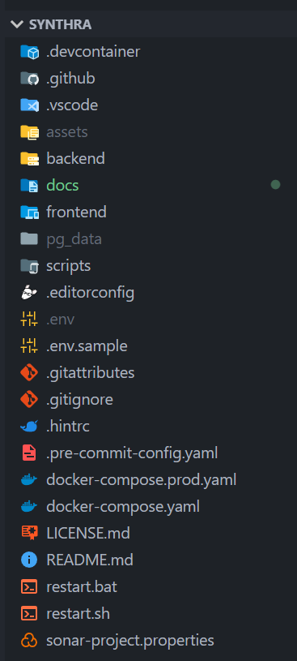

### FastAPI Architecture

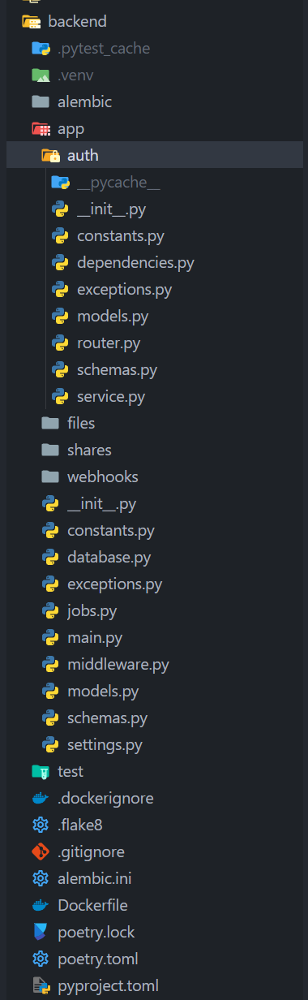

### SvelteKit Architecture

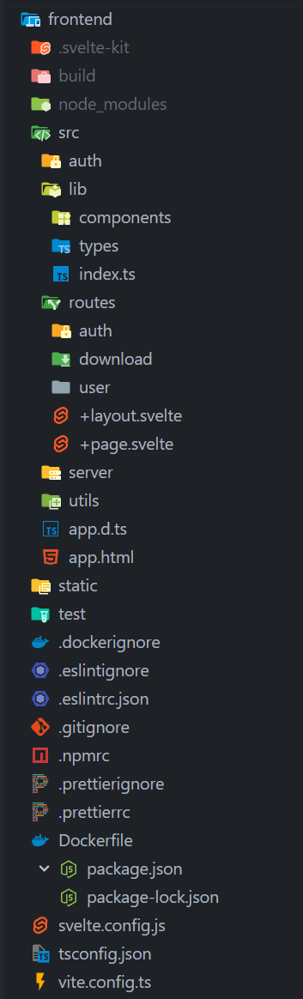

### Swagger (OpenAPI) Documentation

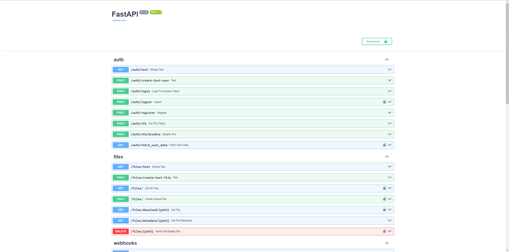
